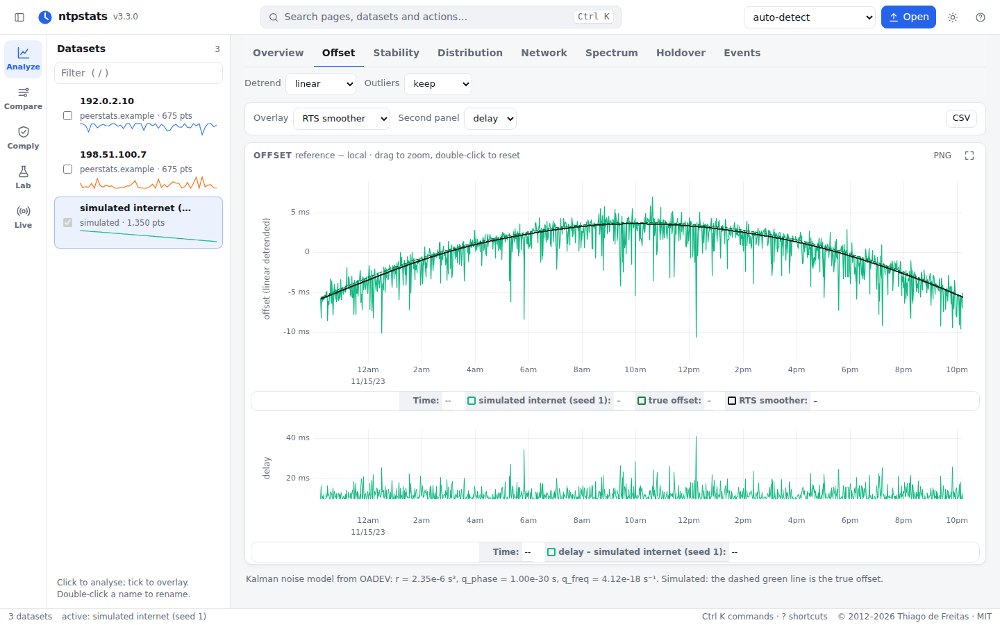
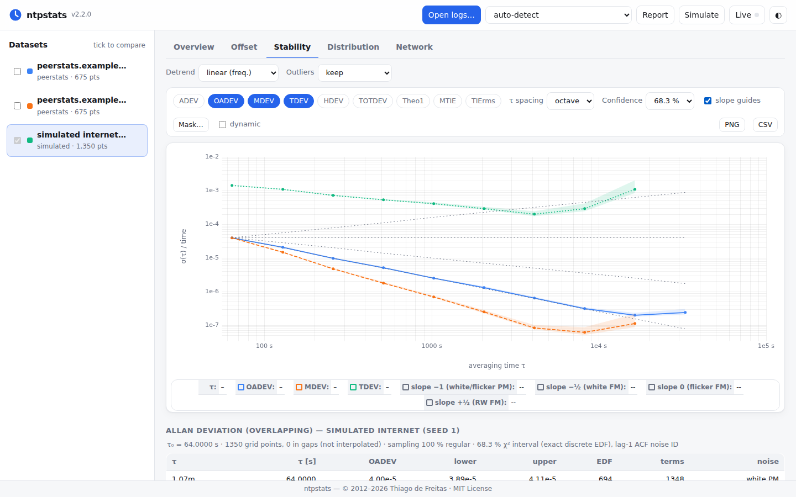
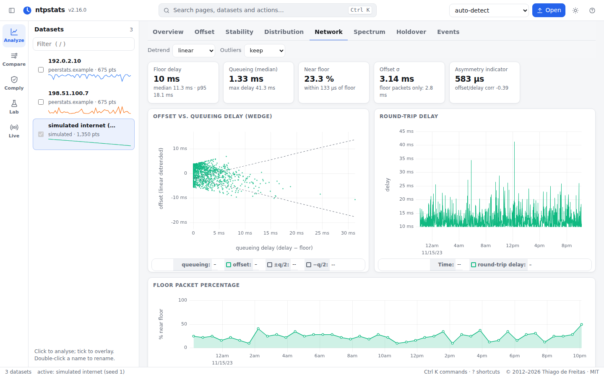
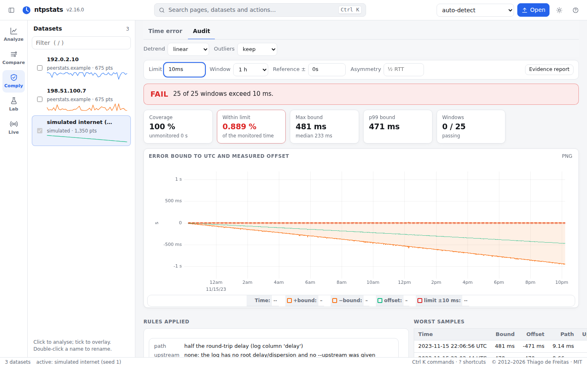
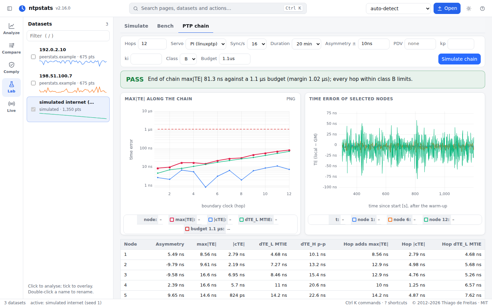
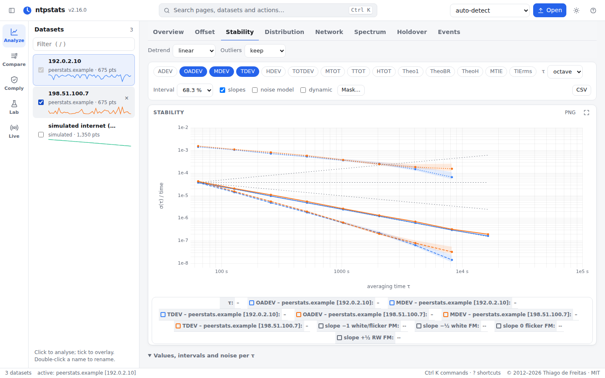
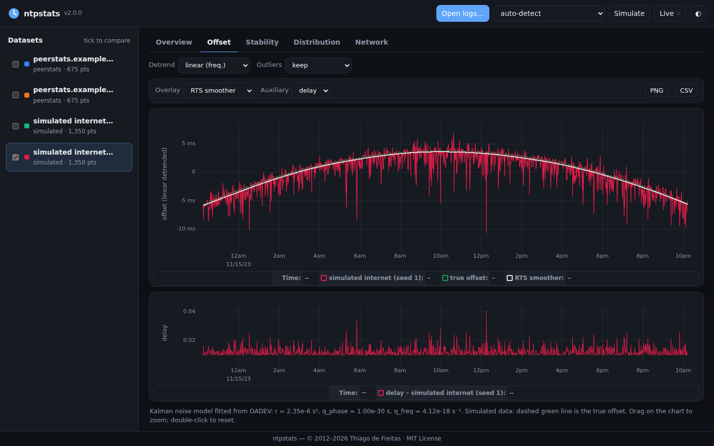
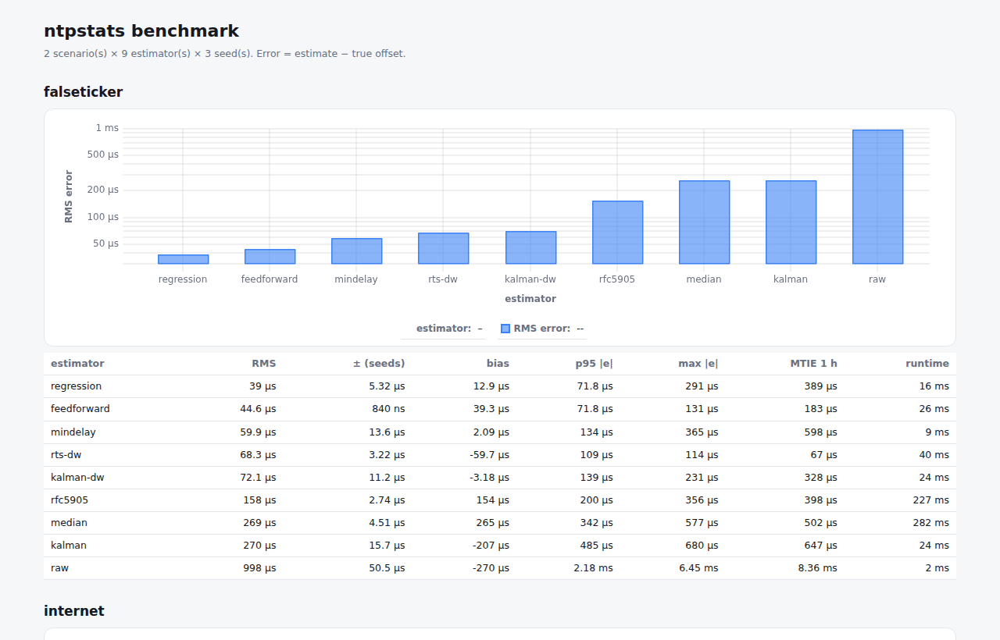

# ntpstats — NetworkTime analysis toolkit

**Validate, evaluate and study network time synchronisation.** `ntpstats` reads what time
systems already produce: logs of **ntpd, NTPsec, chrony and linuxptp**, packet captures of
**NTP and PTP**, GNSS time-transfer and laboratory files, and the results of network simulators.
From them it computes the statistics used in timing research and telecom standards, each with a
stated uncertainty:
- frequency stability (ADEV … TheoH, MTIE) with confidence intervals and noise identification;
- time error (max|TE|, cTE, dTE) with limits and masks;
- an audited error bound to UTC.

It measures servers itself with NTPv4, NTS, NTPv5 and Roughtime clients. A simulator with
**ground truth** turns it into a test bench for synchronisation algorithms, on modelled or
replayed networks and on PTP boundary-clock chains. Use it as a command-line tool, a Python
library with a [stable API](https://thiagodefreitas.github.io/NetworkTime/api/stable/), a
local web UI, or [in your browser](https://thiagodefreitas.github.io/NetworkTime/browser/)
without installing anything.

📖 **Documentation:** [thiagodefreitas.github.io/NetworkTime](https://thiagodefreitas.github.io/NetworkTime/)
· [Wiki](https://github.com/thiagodefreitas/NetworkTime/wiki) · `pip install ntpstats`

It started as a Google Summer of Code 2012 project for the NTP Project (kept unchanged in
[`legacy/`](legacy/)). Version 2 was a complete rewrite, and since **3.0** the Python API is final
for the whole 3.x series. See
[docs/STATE_OF_THE_ART.md](docs/STATE_OF_THE_ART.md) for what changed in NTP since 2012 and what
was wrong with the original code, [docs/INTEROP.md](docs/INTEROP.md) for live results against
public NTP/NTS/NTPv5/Roughtime servers (recorded monthly in the open dataset [`data/interop/`](data/interop/)), [CHANGELOG.md](CHANGELOG.md) for releases and
[ROADMAP.md](ROADMAP.md) for where it is going, and [docs/LANDSCAPE.md](docs/LANDSCAPE.md) for how it
relates to Stable32, TimeLab, allantools, linuxptp, PTP Track Hound and other tools.

**Contributions welcome**, from industry and research alike: sample logs and instrument exports
are as valuable as code. Look for issues labelled
[`good first issue`](https://github.com/thiagodefreitas/NetworkTime/labels/good%20first%20issue),
[`industry`](https://github.com/thiagodefreitas/NetworkTime/labels/industry) or
[`research`](https://github.com/thiagodefreitas/NetworkTime/labels/research), and see
[CONTRIBUTING.md](CONTRIBUTING.md). Using it in a paper? Please cite it ([CITATION.cff](CITATION.cff)).



| | |
|---|---|
|  |  |
|  |  |
|  |  |

## Highlights

- **Every common source, auto-detected**:
  - ntpd/NTPsec `loopstats`, `peerstats` (per peer, `sys.peer` picked automatically) and
    `rawstats` (offset/delay recomputed from the four on-wire timestamps);
  - chrony `tracking.log`, `measurements.log`, `statistics.log` and `refclocks.log`
    (GNSS/PPS reference clocks);
  - **PTP**: linuxptp `ptp4l`, `phc2sys`, `ts2phc` output from stdout, syslog or journald
    (monotonic stamps are mapped to UTC when the journal prefix is present);
  - **packet captures** (pcap/pcapng, including nanosecond and hardware timestamps): NTP
    exchanges and **PTP flows** (one-/two-step, E2E/P2P, UDP or Ethernet) are measured from the
    capture host's clock;
  - **live**: chrony, ntpd/NTPsec, linuxptp (`pmc`) and facebook/time `ptpcheck`; Windows
    `w32tm /stripchart`; Prometheus range queries (ntpd-rs, chrony_exporter);
  - **instrument exports** via small TOML profiles (time-interval counters, PTP testers);
  - **research and laboratory data**: CGGTTS GNSS time transfer (with common view), IGS RINEX
    clock files, BIPM Circular T (UTC − UTC(k)), RIPE Atlas NTP results and NTP Pool monitor logs;
  - generic CSV and the 2012 `estimators.log`.

  Every sign convention is normalised to *reference − local*, following each implementation's
  documentation (table below).
- **Stability analysis done right**: non-overlapping and overlapping ADEV, MDEV, TDEV,
  overlapping Hadamard, total, modified total, time total and Hadamard total deviation (TOTDEV,
  MTOT, TTOT, HTOT), Theo1, TheoBR, TheoH, MTIE (O(N log N)) and TIErms. The results reproduce the **NIST SP 1065
  test suites to 7 digits**, and each statistic comes with
  - χ² confidence intervals from the **exact** equivalent degrees of freedom of the discrete
    power-law model (Monte Carlo verified),
  - per-τ power-law noise identification (lag-1 autocorrelation method),
  - correct τ₀ from the data and **gap handling that never invents data** (irregular logs are
    put on a grid; terms that would span a gap are dropped, not interpolated),
  - **dynamic** (sliding-window) views to expose non-stationarity,
  - **limit-mask** checks against user-supplied CSV masks (`tau,tdev`, `tau,mtie`, … e.g.
    network TDEV/MTIE limits), with margins and PASS/FAIL,
  - **compare** a source against a reference (PPS, GNSS or a better server) to get the error's
    bias, RMS, TDEV and MTIE.
- **Clock metrology**:
  - fit the **power-law noise model** h₋₂…h₂ (and drift), with bootstrap intervals
    (`ntpstats noise`), and turn it into a simulator scenario;
  - phase and frequency **spectra** and L(f) (`ntpstats spectrum`);
  - the **N-cornered hat / Groslambert covariance** to find which of three or more servers or
    clocks is the noisy one without a better reference (`ntpstats hat`);
  - **holdover prediction**: how long a clock stays within 1.1 µs, 100 µs or 1 ms if GNSS or
    the network is lost, with a calibrated envelope and a backtest on your own log
    (`ntpstats holdover`).
- **Telecom time error**: max|TE|, cTE, dTE_L/dTE_H, max|TEL|, and MTIE/TDEV of dTE_L, checked
  against your own limits and masks (`ntpstats timeerror`, exit code 3 on failure). Input can be
  a PTP capture, a linuxptp log or a time-interval counter.
- **Assurance**: `ntpstats audit` gives a per-sample error bound to UTC with stated assumptions,
  coverage and an archivable HTML/JSON report with input hashes (MiFID II RTS 25, DORA, NIS2
  evidence). `ntpstats events` finds steps, spikes, frequency and route changes and leap smears.
  Timing checks run in CI through a **GitHub Action** or **pytest** assertions.
- **Clock-error bounds checked, not trusted**: `ntpstats bounds` measures how often AWS
  ClockBound, fbclock or any `[earliest, latest]` window really contains true time.
- **Works with the tools you have**:
  - Stable32 data files in and out (`ntpstats convert`);
  - **pandas, xarray and Parquet** (`series.to_pandas()`, `convert --to parquet`);
  - **plugins**: other packages add formats, estimators, detectors, masks and profiles
    (`ntpstats plugins`);
  - an **allantools-compatible API** (`from ntpstats.compat import allantools`);
  - **Prometheus/OpenMetrics** and **OpenTelemetry (OTLP)** from `monitor`/`watch`, including an error bound and rolling
    TDEV, plus a Grafana dashboard, alert rules and a docker-compose stack in
    [`contrib/`](contrib/).
- **Network metrics**: delay floor and queueing distribution, Mills' offset-vs-delay *wedge*,
  asymmetry indicator, floor packet percentage (ITU-T G.8260-style), NTP clock-filter
  (minimum delay) selection.
- **Estimators**: two-state Kalman filter with irregular sampling, noise parameters fitted
  from the data's ADEV, innovation gating, delay-aware measurement weighting and an
  RTS smoother.
- **Research bench**: simulated clocks and networks with ground truth, and pluggable
  estimators scored by `ntpstats bench`:
  - simulator: power-law oscillator noise (white/flicker PM, white/flicker/random-walk FM),
    frequency offset, drift, temperature wander, asymmetric queueing paths, route changes,
    congestion and outages, and multi-server scenarios with falsetickers;
  - reference algorithms: Kalman/RTS, NTP clock filter, chrony-style regression,
    RADclock-style feed-forward, a Huygens-style convex hull, RFC 5905 select/cluster/combine,
    and an ntpd-rs-style multi-server combination;
  - bring your own estimator via a small API or a package entry point; scenarios can be
    presets or TOML files;
  - reproducible reports as tables, CSV/JSON or self-contained HTML;
  - **real networks**: per-direction delays extracted from a capture or log (`ntpstats trace`),
    replayed under the simulated clock (`ntpstats bench trace:FILE`);
  - **PTP chains**: a grandmaster and N boundary clocks with linuxptp-style servos, checked per hop
    and end to end against a time-error budget (`ntpstats chain`);
  - **network simulators**: OMNeT++/INET vector files in and out (INET clocks become time error),
    ns-3 text, and INET oscillator settings fitted to a real clock (`ntpstats noise --inet`).
- **Reports**: `ntpstats report` writes a single offline HTML file with charts, CI tables,
  network analysis, parameters and input hashes (also a *Report* button in the UI).
- **Measurement clients** (they never set the clock):
  - NTPv4 SNTP with a random transmit timestamp (data minimisation), origin check,
    Kiss-o'-Death and 2036 era handling;
  - **NTS** (RFC 8915): NTS-KE over TLS 1.3 with certificate and host-name checks, AES-SIV
    authenticated exchanges and cookie renewal (optional extra `ntpstats[nts]`);
  - **NTS pools** (NTS-KE server deny records) and the **RFC 9769 interleaved mode**;
  - experimental **NTPv5** (draft-ietf-ntp-ntpv5-09): v5 header with cookies, timescale and
    era, plus the NTPv4→v5 upgrade probe;
  - **Roughtime** (draft-19): signed time from several servers, chained so that a lying server
    is provable (malfeasance reports), and an authenticated bound on the local clock's error;
  - a polite `monitor` (RATE back-off, jitter), and `watch`, which samples the local
    **chrony** (`chronyc -c tracking`) or **ntpd/NTPsec** (`ntpq -c rv`) without log files.
- **Lightweight UI**: `ntpstats ui` starts a local web app. It runs on the Python standard
  library HTTP server with one static page and [uPlot](https://github.com/leeoniya/uPlot) (≈50 kB,
  bundled, MIT), so there is no Qt, Electron, Node or CDN, and it works offline.
  - Five workspaces: *Analyze*, *Compare* (reference, cornered hat), *Comply* (time error, audit with
    a verdict), *Lab* (simulator, estimator bench, PTP chains) and *Live*.
  - A command palette (Ctrl K), keyboard shortcuts and a link for every page.
  - Dataset sparklines, light and dark themes, drag-and-drop, overlays, zoom-to-analyse, and
    PNG/CSV/HTML export. The same UI also runs **in the browser** on the docs site (Pyodide/WebAssembly; files
  never leave your machine).
- **Small footprint**: the only runtime dependency is **numpy**. matplotlib is optional
  (static/publication figures).

## Install

```bash
pip install ntpstats                # core + UI (numpy only)
pip install "ntpstats[plot]"        # + matplotlib figures
pip install "ntpstats[nts]"         # + NTS client (pyOpenSSL, cryptography)
pip install "ntpstats[data]"        # + pandas, xarray, Parquet
pip install git+https://github.com/thiagodefreitas/NetworkTime.git   # latest master
# from a checkout, for development:
pip install -e ".[test,plot,nts,docs]" && pytest
```

Python ≥ 3.9.

## Quick start

```bash
# Web UI (opens your browser at http://127.0.0.1:8123)
ntpstats ui /var/log/chrony/measurements.log /var/log/ntpstats/peerstats

# Summary statistics
ntpstats info /var/log/ntpstats/loopstats.20260928

# Stability table with 95 % confidence intervals and noise identification
ntpstats stability /var/log/chrony/tracking.log -k oadev,mdev,tdev,mtie --ci 0.95

# Check TDEV against a limit mask (CSV "tau,tdev"); exit code 3 on failure
ntpstats stability ptp.log -k tdev,mtie --mask my-tdev-mask.csv

# Validate a client against a reference (e.g. chrony vs a PPS refclock or GNSS host)
ntpstats compare /var/log/chrony/tracking.log /var/log/chrony/refclocks.log --ref-peer PPS0

# Sliding-window stability matrix (time x tau) as CSV
ntpstats dynamic peerstats --peer 192.0.2.10 -k mdev

# Network behaviour of one peer
ntpstats network /var/log/ntpstats/peerstats --peer 192.0.2.10

# Filters (Kalman / RTS smoother / min-delay) -> CSV
ntpstats filter peerstats --peer 192.0.2.10 -m rts -o smoothed.csv

# Publication figure (needs matplotlib)
ntpstats plot peerstats --all-peers -k oadev,tdev --detrend linear -o report.pdf

# Measure a server yourself (never sets the clock)
ntpstats query time.cloudflare.com -c 4
ntpstats monitor pool.ntp.org ptbtime1.ptb.de -i 64 -o mylog.csv

# Test bench: simulate NTP exchanges and score the built-in estimators
ntpstats simulate --preset internet --benchmark
```

```
Scenario 'internet': 1350 exchanges, poll 64 s, seed 1
   estimator                               rms       bias  p95 |err|  max |err|
   raw measurements                    1.65 ms    -659 µs    3.61 ms    14.1 ms
   Kalman                               617 µs    -569 µs     945 µs    1.84 ms
   Kalman + delay weighting             183 µs    -139 µs     355 µs    1.31 ms
   RTS smoother + delay weighting       210 µs    -202 µs     293 µs     315 µs
   min-delay filter (8)                 112 µs     761 ns     248 µs     752 µs
```

More measurement commands:

```bash
ntpstats query time.cloudflare.com --nts            # NTS-authenticated (pip install 'ntpstats[nts]')
ntpstats query ntpd-rs.example.net --ntpv5          # experimental NTPv5 draft-09
ntpstats query pool.ntp.org --probe-v5              # does the server offer NTPv5?
ntpstats query time.example.net --interleaved       # RFC 9769: precise server transmit time
ntpstats roughtime --check-local                    # signed time; exit 3 if servers or this clock disagree
ntpstats watch chrony -i 16 -o chrony-live.csv      # local daemon, no log files needed
ntpstats info capture.pcapng                        # NTP exchanges from a packet capture
ntpstats stability /var/log/ptp4l.log -k tdev,mtie  # PTP servo offsets
```

### Benchmarking synchronisation algorithms

```bash
ntpstats bench --list                                        # estimators and preset scenarios
ntpstats bench internet falseticker examples/scenarios/*.toml --seeds 1-10 \
        --html bench.html --csv bench.csv                    # full comparison
python examples/04_custom_estimator.py                       # plug in your own algorithm
ntpstats bench trace:capture.pcap                            # replay a real network's delays
ntpstats bench examples/scenarios/replay-chrony.toml --seeds 1-5 --html bench.html
ntpstats chain --hops 10 --class B                           # PTP boundary clocks vs a TE budget
```



Example reports: [benchmark](docs/examples/benchmark-report.html),
[benchmark on a replayed trace](docs/examples/trace-benchmark.html),
[peerstats analysis](docs/examples/peerstats-report.html) (download and open in a browser).

Some findings the bench makes visible:
- On a congested WAN, the delay-aware estimators (regression, feed-forward, min-delay,
  delay-weighted Kalman) cut the error 10–30× compared with the raw measurements.
- An asymmetric route change (`route-change` preset) biases *every* estimator by half the
  one-way step, and no amount of filtering can see it.
- RFC 5905 selection rejects falsetickers only when their error exceeds the root distance
  (≈ delay/2). Smaller ones are indistinguishable from path asymmetry by design.
- With symmetric floor delays, the Huygens-style `hull` estimator, which uses every exchange's
  bound θ ± δ/2, is often an order of magnitude more accurate than the clock filter.
- In a chain of PTP boundary clocks, linuxptp's default PI gains amplify noise hop after hop
  (gain peaking): 10 hops end near 50 ns, 20 near 600 ns. A narrower loop keeps 20 hops near 25 ns.

Common options: `--format` (override detection), `--peer`, `--all-peers`,
`--start/--end` (POSIX seconds or ISO 8601 UTC), `--outliers K` (drop > K·MAD after
detrending), `--json`/`--csv` output.

### Sign conventions

| Source | Logged as | ntpstats |
|---|---|---|
| ntpd/NTPsec loopstats, peerstats, rawstats, `ntpq rv` | reference − local | kept |
| chrony `measurements.log` (θ), `refclocks.log` (cooked), `chronyc tracking` "System time" | reference − local ("positive = local slow") | kept |
| chrony `tracking.log`, `statistics.log`, `chronyc sourcestats` | local − reference ("positive = local fast") | negated |
| linuxptp `master offset` / `offset` (ns) | local − reference | negated, converted to s |
| pcap captures | computed from server T2/T3 and capture times | reference − capture host |

### Enabling the logs

- **chrony** (`/etc/chrony/chrony.conf` or `/etc/chrony.conf`): `log tracking measurements statistics refclocks`
  and `logdir /var/log/chrony`.
- **linuxptp**: run `ptp4l`/`phc2sys` with `-m` (stdout) or collect
  `journalctl -u ptp4l -o short-iso-precise`, which gives UTC time stamps.
- **captures**: `tcpdump -i eth0 -j adapter_unsynced --time-stamp-precision=nano -w ntp.pcap udp port 123`.
- **ntpd / NTPsec** (`ntp.conf`): `statsdir /var/log/ntpstats/`, `statistics loopstats peerstats rawstats`,
  `filegen peerstats file peerstats type day enable` (same for the others).

### Docker

```bash
docker build -t ntpstats .
docker run --rm -p 8123:8123 -v "$PWD:/data" ntpstats ui /data/peerstats --host 0.0.0.0 --no-browser
docker run --rm ntpstats query --nts time.cloudflare.com
```

### Performance

On a modest shared CPU: parsing takes about 1 s per million loopstats lines (2.4 s for
peerstats) using numpy's C tokenizer, and a full stability analysis (OADEV/MDEV/TDEV/HDEV with
exact-EDF confidence intervals) of **1 million samples** takes about 1.2 s. The UI only receives
decimated data (min/max per bucket), so it stays responsive with large files.

## Python API

```python
from ntpstats import api as nt

s = nt.load_one("/var/log/chrony/measurements.log", peer="192.0.2.10")
print(nt.summary(s)["range_90"])
for r in nt.series_stability(s, kinds=("oadev", "tdev"), ci=0.95):
    print(r.kind, r.taus, r.dev, r.lo, r.hi, r.alpha)

meas, truth = nt.simulate_ntp(nt.Scenario(duration=86400, seed=1))
print(nt.compare(nt.kalman_series(meas, smooth=True), truth))

chain = nt.simulate_chain(nt.ChainScenario(hops=10))            # PTP boundary clocks
print(chain.check(cls="B")["passed"], chain.nodes[-1]["max_te"])
```

The names in `ntpstats.api` are the [stable API](https://thiagodefreitas.github.io/NetworkTime/api/stable/),
covered by a deprecation policy. [Notebooks](examples/notebooks/) cover a chrony log to a noise model,
benchmarking your own algorithm (also on a real log's delays), compliance evidence, a PTP chain against
a time-error budget, and a reproduction of NIST SP 1065. They run in CI.
Logs of several gigabytes are read in blocks (`ntpstats.api.load_large`).

More in [`examples/`](examples/): `01_quickstart.py`, `02_benchmark_filters.py` (a template for
evaluating your own algorithm), `03_report_figure.py`, and `make_example_logs.py`, which
regenerates the sample logs in `examples/data/` in each native format.

## Validation

`pytest` runs about 170 tests (plus `ruff` lint and coverage in CI), and none of them need network access:

- every estimator is checked against a literal implementation of the NIST SP 1065 sums, against
  the analytic log-log slopes of the five power-law noise types, and against a frozen table of
  values from an independent implementation (no third-party stability library is needed);
- the confidence-interval coverage is checked by Monte Carlo;
- noise identification is checked for α = +2 … −2;
- parsers are checked on the line layouts from the ntpd and chrony documentation, and by
  cross-checking that the same simulated peer reads identically from peerstats, rawstats and
  chrony logs;
- the SNTP, NTPv5 and NTS clients are checked against local test servers (offset, delay, KoD,
  spoofed replies, timeouts, 2036 rollover, TAI timescale, forged NTS responses, certificate
  mismatch);
- the pcap/pcapng readers are checked on synthesised captures (VLAN tags, nanosecond
  resolution, NTPv4 and v5 matching), and the linuxptp parser on the exact `pr_info` formats from
  the linuxptp source;
- the web API is checked, including its CSRF, Host-header and path-traversal protections.

CI runs on Python 3.9, 3.11 and 3.13.

## Security notes

The UI binds to `127.0.0.1`, rejects foreign `Host` headers (DNS rebinding), requires a custom
header on all state-changing requests (CSRF) and sends a strict Content-Security-Policy. It has no
authentication, so do not expose it with `--host 0.0.0.0` on untrusted networks. The SNTP client
is for measurement only: it does not authenticate time (for NTS use chrony or NTPsec and analyse
their logs).

## Project layout

```
src/ntpstats/     api (stable surface), parsers, stream, pcap, ptp, research, stability, edf,
                  masks, timeerror, audit, events, bounds, analysis, network, filters,
                  spectrum, noisefit, hat, holdover, simulate, estimators, bench, trace,
                  ptpsim, simio, report, sntp (v4/v5), nts, roughtime, sources, monitor,
                  metrics, otlp, adapters, plugins, cli, plotting
src/ntpstats/web  stdlib HTTP server + static UI (plain JS, uPlot vendored), also run by Pyodide
tests/            pytest suite (+ frozen reference data, API snapshot, browser tests)
examples/         scripts, notebooks, scenarios, an example plugin and sample logs
docs/             state of the art, live interop results, example reports, screenshots
legacy/           the original 2012 GSoC code, untouched
```

## License and citation

MIT License. © 2012–2026 **Thiago de Freitas** ([@thiagodefreitas](https://github.com/thiagodefreitas)). Free for commercial
and non-commercial use; please keep the copyright notice and credit the author (see
[NOTICE](NOTICE)). If you use it in research, please cite it via [CITATION.cff](CITATION.cff).
The bundled uPlot is MIT-licensed © Leon Sorokin. The code under `legacy/` keeps its original
2012 license.
