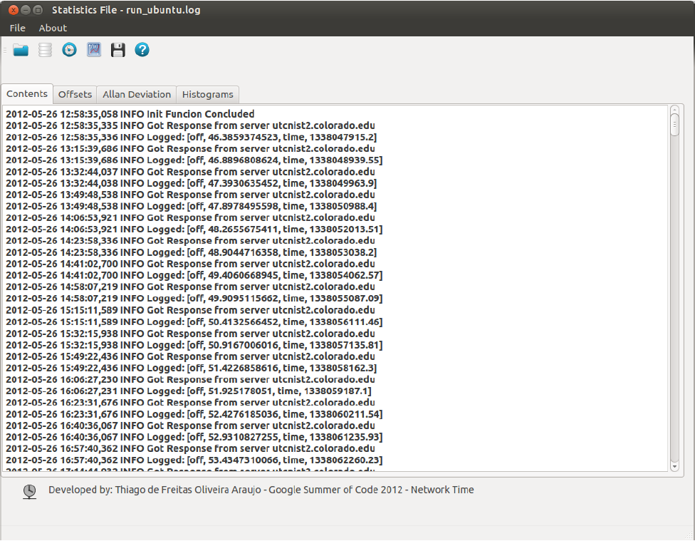

# Legacy: Google Summer of Code 2012 prototype

This directory contains the original 2012 code by Thiago de Freitas (Python 2, PySide/Qt 4,
matplotlib 1.x), kept for reference and history (only the author contact lines were changed to a
GitHub link). It does not run on current systems and
is **not** used by the `ntpstats` package.

The code was the software part of the author's undergraduate thesis, written during the Google Summer
of Code 2011 and 2012 projects for the NTP Project:

> Araújo, T. F. O. (Thiago de Freitas). *Modelagem e análise de relógios locais para otimização de
> sincronismo horário em rede.* Trabalho de Conclusão de Curso (Electrical Engineering), Universidade
> Federal de Campina Grande, 20 December 2012. Advisor: A. M. N. Lima.
> <https://dspace.sti.ufcg.edu.br/handle/riufcg/18226>

The thesis is assessed, and its experiments are re-run against known truth and on the 2012 data kept
here (`gsoc2012/core_noGUI/estimators.log`, `offsets_estimation.txt`, `computeTime_estimation.txt`),
in [`research/thesis-2012`](../research/thesis-2012/).

`docs/STATE_OF_THE_ART.md` describes the issues found in this code and how version 2 addresses
them. The code keeps its original license (`gsoc2012/COPYING`, GPL). The vendored
`ntplib-0.1.9` is LGPL (see its own files).

