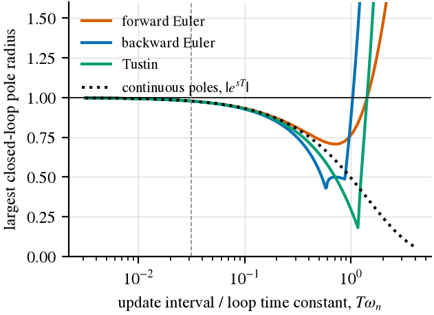

# The 2012 thesis, revisited

ntpstats started as the software part of the author's undergraduate thesis (Trabalho de Conclusão de
Curso, Electrical Engineering, Universidade Federal de Campina Grande, defended 20 December 2012),
written alongside two Google Summer of Code projects for the NTP Project:

> Araújo, T. F. O. (Thiago de Freitas). *Modelagem e análise de relógios locais para otimização de
> sincronismo horário em rede* (Modelling and analysis of local clocks for optimising network time
> synchronisation). Trabalho de Conclusão de Curso, Universidade Federal de Campina Grande, 2012.
> Advisor: A. M. N. Lima. <https://dspace.sti.ufcg.edu.br/handle/riufcg/18226>

```bibtex
@thesis{araujo2012tcc,
  author      = {Ara{\'u}jo, Thiago de Freitas Oliveira},
  title       = {Modelagem e an{\'a}lise de rel{\'o}gios locais para otimiza{\c{c}}{\~a}o de sincronismo hor{\'a}rio em rede},
  type        = {Trabalho de Conclus{\~a}o de Curso (Engenharia El{\'e}trica)},
  institution = {Universidade Federal de Campina Grande},
  address     = {Campina Grande, Brazil},
  year        = {2012},
  date        = {2012-12-20},
  url         = {https://dspace.sti.ufcg.edu.br/handle/riufcg/18226},
  langid      = {portuguese}
}
```

This folder asks what the thesis got right, what can be reproduced, and what can now be done better.
Everything below comes from [`replicate.py`](replicate.py), which runs on ntpstats 3.5.0 in about
twenty seconds and writes [`data/`](data/) and [`figures/`](figures/). The 2012 measurements it uses
are the original files kept in [`legacy/gsoc2012/core_noGUI/`](../../legacy/gsoc2012/core_noGUI/).

## What the thesis did

The motivation was server load: if a client's clock is modelled well enough, it can poll less often.
The thesis set two objectives: a parameter that links the poll interval with the achievable accuracy,
and a better model of the local clock and the network delay. Its chapters cover:

1. phase- and frequency-locked loops (PLL, FLL), and why NTP needs a type II loop (chapters 2 and 4);
2. clock statistics: power-law noise, Allan and modified Allan variance (chapter 3);
3. NTP's hybrid PLL/FLL discipline as a continuous model, then discretised with forward Euler,
   backward Euler and Tustin, and simulated in Simulink with random, step, ramp and noisy inputs
   (chapter 5);
4. a correction loop: Savitzky-Golay smoothing (5th order, 39-sample window) followed by a two-state
   Kalman filter, plus a Kalman filter in the noise-model form of Levine (chapters 6 and 7);
5. real-time experiments against `utcnist2.colorado.edu`, polling every 32 s, with a free-running
   clock and with ntpd running, judged by offset plots and by the Allan deviation of the corrected
   offsets (chapter 8);
6. the open-source analysis program that became ntpstats (chapter 9).

It concludes that the algorithm corrects the clock without NTP and improves NTP when run alongside it.

## Assessment

| Topic | Then | Now | Evidence |
|---|---|---|---|
| Type I vs type II loop | A type I loop cannot follow a frequency offset (a ramp of phase); NTP needs type II | **Confirmed.** Standard control theory, and the design of RFC 5905. The bench's PI servos (type II) remove a frequency offset to below 1 ns | `tests/test_ptpsim.py` |
| Damping | "critically damped (Butterworth), ζ = √2" | **Corrected.** Butterworth is ζ = 1/√2; critical damping is ζ = 1 | textbook |
| Discretisation (ch. 5) | Euler and Tustin compared in simulation; figures only, no conclusion stated | **Replicated, with a clear answer.** At NTP's ratio (loop time constant about 32 update intervals, as the thesis notes) the three methods put the closed-loop poles within 0.0005 of the continuous system's. They differ only when the update interval approaches the time constant; the loop loses stability at Tω<sub>n</sub> ≈ 1.04 (backward Euler controller) and 1.44 (forward Euler and Tustin). For NTP the choice of discretisation does not matter | R4, figure below |
| Clock error from ADEV (ch. 6) | time error ≈ τ·σ<sub>y</sub>(τ) | **Superseded.** ntpstats computes the exact time-interval-error variance of a fitted power-law model, including the uncertainty of the fitted frequency (`ntpstats holdover`) | [Metrology](../../docs/metrology.md) |
| Outliers (ch. 6) | removed with Savitzky-Golay | **Revised.** A linear smoother spreads an outlier over its window rather than removing it. ntpstats detects spikes and steps with robust (MAD-scaled) statistics (`ntpstats events`) | [Assurance](../../docs/assurance.md) |
| Kalman model (ch. 7) | state (phase, frequency), F = [[1, τ], [0, 1]] | **Confirmed** (the standard two-state clock model, used by `kalman` and `kalman-dw`) | `ntpstats.estimators` |
| Kalman measurement and noise (ch. 7) | H = [1, τ]; fixed Q = 10⁻³·I, R = 100 | **Corrected.** An offset measurement observes the phase, H = [1, 0]. Q and R should come from the clock's noise and the network's, which ntpstats now estimates (`ntpstats noise` for h<sub>α</sub>, delay statistics for the measurement) | code below |
| Savitzky-Golay stage (ch. 7, code) | 5th order, 39 samples, before the Kalman filter | **Bug found.** The class in `legacy/.../savitzky.py` defaults to `deriv=2`, and `estimators.py` builds it without that argument, so the stage returned the *second derivative* of the offsets. On a test quadratic it returns exactly 2c; on the real December 2012 offsets it turns 16.4 ms rms into 0.13 ms rms. The intended smoother leaves 11.8 ms | R1 |
| Real-time use of the smoother | applied in the correction loop | **Not realisable as written.** A centred 39-sample window needs 19 future samples (about 10 minutes at 32 s). A causal version (fit the last 39 samples, evaluate at the newest) is realisable but gains less | R3 |
| Evaluation (ch. 8) | lower Allan deviation of the corrected offsets taken as better synchronisation | **Not a valid criterion.** Smoothing lowers the Allan deviation of any series. On the December 2012 data a correct Savitzky-Golay pass lowers σ<sub>y</sub>(32 s) 25-fold (6.4×10⁻⁴ to 2.6×10⁻⁵) and changes the identified noise type, with no new information about the clock. In simulation with known truth, the pipeline as built has the second-lowest Allan deviation of the nine estimators (1.4×10⁻⁷ at 32 s, against 8.0×10⁻⁵ raw) and by far the largest error (132 ms rms, against 1.6 ms raw) | R2, R3 |
| Conclusions (ch. 10) | corrects the clock without NTP; improves NTP when run in parallel | **Not supported by the evidence presented.** The experiments recorded no independent reference, so they can neither confirm nor refute the claim. Against simulated truth, the intended pipeline (centred smoother + 2012 Kalman) halves the raw error, but only offline; the same exchanges give 167 µs with a delay-weighted Kalman filter, 53 µs with regression and 3 µs with the hull estimator | R3 |
| Objective 1: poll interval vs accuracy | stated, not resolved | **Answered for the 2012 clock.** See below | R5 |
| Software (ch. 9) | Python 2, PySide, numpy, scipy | **Rewritten** as ntpstats; the 2012 code is kept unchanged in `legacy/` | [STATE_OF_THE_ART](../../docs/STATE_OF_THE_ART.md) |

### The ground-truth comparison (R3)

The internet preset of the bench with 32 s polling, 12 hours, five seeds, the first 30 minutes
excluded. "OADEV" is the Allan deviation of the estimate itself, the quantity the thesis plotted; the
true clock's is 3.0×10⁻¹⁰ at 32 s.

| Estimator | rms error vs truth | OADEV of the estimate, 32 s |
|---|---|---|
| raw offsets | 1605 µs | 8.0×10⁻⁵ |
| Savitzky-Golay 5/39, centred (offline only) | 791 µs | 3.2×10⁻⁶ |
| Savitzky-Golay 5/39, causal | 1306 µs | 3.5×10⁻⁵ |
| 2012 Kalman filter | 1299 µs | 4.3×10⁻⁵ |
| centred Savitzky-Golay + 2012 Kalman (the design of ch. 7) | 795 µs | 1.9×10⁻⁶ |
| as built: Savitzky-Golay with `deriv=2` + 2012 Kalman | 131 524 µs | 1.4×10⁻⁷ |
| `kalman-dw` (delay-weighted Kalman) | 167 µs | 4.9×10⁻⁷ |
| `regression` (chrony-style) | 53 µs | 1.0×10⁻⁶ |
| `hull` (Huygens-style) | 3.2 µs | 1.8×10⁻⁸ |

The two columns rank the estimators in different orders. The lesson is the one the bench is built
on: a synchronisation algorithm has to be scored against a reference, not by the smoothness of its
own output.

### Discretisation (R4)



A type II PI loop (ζ = 1/√2) whose phase integrator is exact and whose controller is discretised three
ways. The dashed line marks NTP's ratio of about 1/32.

### Poll interval versus accuracy (R5)

The May 2012 log (`estimators.log`) is a free-running PC clock measured against utcnist2 every
1024 s for five days. Its frequency offset was 491.3 ppm in the first segment and 491.0 ppm three days
later, confirming the thesis's remark that PC clocks can be off by up to 500 ppm and showing that this
one was nevertheless stable. After removing frequency and drift, the residual is 8.5 ms rms, and
ntpstats' noise fit finds only white phase noise, that is, the network. The clock's own wander is
below what this path can detect (upper limits: h<sub>0</sub> ≤ 2.5×10⁻¹⁰, flicker FM floor
≤ 3.9×10⁻⁸).

The holdover model then gives the 95 % time error of the corrected clock as a function of the time
since the last measurement, which is the link between poll interval and accuracy that the thesis
asked for:

| interval | 64 s to 1024 s | 4096 s | 16 384 s | 65 536 s |
|---|---|---|---|---|
| 95 % time error | 21.2 ms | 22.1 ms | 24.6 ms | 39.2 ms |

For this clock and this path the network dominates: polling every 4.5 hours instead of every 17
minutes costs 3.4 ms at the 95 % level. One machine and one week of data do not make a general
result, and temperature changes were not recorded, but the method is general. It is a candidate for
a `ntpstats` command (see the roadmap).

## What carries over

- **The data.** The May and December 2012 logs are real measurements of a PC clock against a NIST
  server: free-running in May (491 ppm), and in December at 32 s polling with a frequency offset of
  about 1 ppm, so most likely disciplined. They are kept in `legacy/` and analysed here.
- **The question of objective 1**, now answerable with the noise fit and the holdover model, and
  worth turning into a poll-interval advisor.
- **Levine's algorithms**, which the thesis studied (J. Levine, IEEE/ACM Trans. Netw. 3(1):42–50,
  1995, doi:10.1109/90.365436; IEEE Trans. UFFC 46(4):888–896, 1999, doi:10.1109/58.775655). They are
  not yet among the bench's reference estimators.
- **The NTP discipline model of chapters 4 and 5.** The bench scores estimators and PTP servos, but
  not the RFC 5905 hybrid PLL/FLL clock discipline itself; adding it would let the thesis's step and
  ramp experiments be run against truth.
- **Not carried over:** the Savitzky-Golay stage (a causal polynomial fit is what the `regression`
  estimator already does, with a principled window), and Allan deviation of an estimate as a measure
  of its quality.
